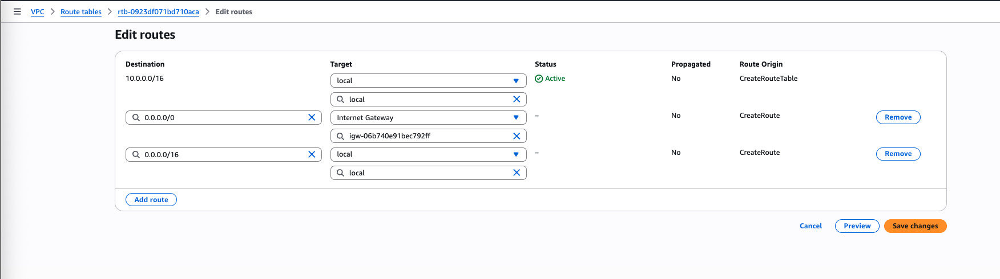

# Travel Memory Application Deployment

## Introduction

The **Travel Memory** application has been developed using the **MERN stack**.  
Your challenge is to deploy this application on an **Amazon EC2 instance**.  
This will provide you with hands-on experience in deploying full-stack applications, working with cloud platforms, and ensuring scalable architecture.

---

## Project Repository

Access the complete codebase of the TravelMemory application here:  
👉 [TravelMemory GitHub Repository](https://github.com/prafulkharat23/TravelMemory)

---

## Objective:

- Set up the backend running on Node.js.

- Configure the front end designed with React.

- Ensure efficient communication between the front end and back end.

- Deploy the full application on an EC2 instance.

- Facilitate load balancing by creating multiple instances of the application.

- Connect a custom domain through Cloudflare.

---

## 🏗️ Architecture Diagram  


The diagram below illustrates the overall deployment setup for the **Travel Memory Application** on AWS:  

- **Users** access the application via their browsers using the domain name managed in **Cloudflare DNS**.  
- Cloudflare provides an additional layer of **security (DDoS protection, caching, SSL termination if enabled)** before forwarding requests to AWS.  
- Requests are routed to the **Application Load Balancer (ALB)**, which distributes traffic across backend EC2 instances for high availability and scalability.  
- **AWS Certificate Manager (ACM)** issues SSL/TLS certificates to enable secure HTTPS communication between ALB and clients.  
- **Target Groups** in ALB manage backend EC2 instances, ensuring only healthy instances receive traffic.  
- The **Frontend** (React) is hosted on Nginx inside an EC2 instance, serving static content.  
- The **Backend** (Node.js/Express) is deployed on multiple EC2 instances for redundancy and load balancing.  


The diagram below illustrates the overall deployment setup for the **Travel Memory Application** on AWS:  

- **Users** access the application via their browsers using the domain name managed in **Cloudflare DNS**.  
- Cloudflare provides an additional layer of **security (DDoS protection, caching, SSL termination if enabled)** before forwarding requests to AWS.  
- Requests are routed to the **Application Load Balancer (ALB)**, which distributes traffic across backend EC2 instances for high availability and scalability.  
- **AWS Certificate Manager (ACM)** issues SSL/TLS certificates to enable secure HTTPS communication between ALB and clients.  
- **Target Groups** in ALB manage backend EC2 instances, ensuring only healthy instances receive traffic.  
- The **Frontend** (React) is hosted on Nginx inside an EC2 instance, serving static content.  
- The **Backend** (Node.js/Express) is deployed on multiple EC2 instances for redundancy and load balancing.  

---

# VPC Setup Guide

This guide documents the step-by-step setup of a **VPC with subnets, internet gateway, and route tables** for internet access.  
Each step also includes the reason **why** we are doing it.


## 1. Create a VPC  
  
A **Virtual Private Cloud (VPC)** is your own isolated network in AWS where you can launch resources like EC2, RDS, etc.  
👉 This gives you control over networking, IP ranges, and security.

---

## 2. Create Subnets in Different Availability Zones  
- **Subnet 1**  
  

- **Subnet 2**  
    

Subnets divide the VPC into smaller networks. Placing them in **different availability zones (AZs)** increases **fault tolerance and high availability**.  
👉 If one AZ fails, resources in another AZ can still run.

---

## 3. Create an Internet Gateway  
  

An **Internet Gateway (IGW)** allows communication between resources in the VPC and the internet.  
👉 Without this, even if your instance has a public IP, it cannot connect outside the VPC.

---

## 4. Attach the Internet Gateway to the VPC  
  

Attaching the IGW makes it available for use by your VPC.  
👉 This step is required to route traffic from your subnets to the internet.

---

## 5. Create a Route Table  
  

A **Route Table** controls how traffic flows within your VPC and outside.  
👉 By default, subnets can only communicate internally. To reach the internet, we need to update routes.

---

## 6. Update Route Table for Internet Access  
- Add a route with **destination: `0.0.0.0/0`** and **target: Internet Gateway**  
    

This tells the VPC:  
👉 Any traffic destined for **anywhere on the internet** should be sent to the IGW.  
Without this, your resources would remain private.

---

## 7. Associate Subnets with the Route Table  
  

By default, new subnets are not associated with custom route tables.  
👉 Associating ensures the subnets follow the rules (like internet access) defined in the route table.

---

✅ The VPC setup with **public subnets and internet access** is now complete.  
Next, you can launch EC2 instances inside these subnets, and they will be able to connect to the internet.

---

## Launch EC2 Instance  

### a. Configure EC2 Instance  
  
- Choose **Ubuntu OS** as the AMI.  
- Select **t2.micro** instance type (eligible for free tier).  
👉 This will be the virtual server running inside your VPC.

---

### b. Configure Network Settings  
  
- Select the **VPC** and **subnet** created earlier.  
- Enable **Auto-assign Public IP** so the instance can connect to the internet.  
👉 Without this, the instance would be private and unreachable from outside.

---

### c. Configure Security Group  
  
Create a **new Security Group** and allow the following ports:  
- **22 (SSH)** → to connect securely to the server.  
- **80 (HTTP)** → to host websites or applications.  
- **443 (HTTPS)** → to host secure applications with SSL/TLS.  

👉 Security groups act as a **firewall** for your instance. Opening only necessary ports reduces security risks.

---

✅ At this point, your EC2 instance is running in the VPC with internet access and required security rules.

---

### Connect to EC2 Instance via SSH

```bash
chmod 400 <PEM_KEY_FILE>
ssh -i <PEM_KEY_FILE> ubuntu@<EC2_PUBLIC_IP>
```

---

### Configure EC2 Instance for delpoyment

#### Step 1: Update your EC2 instance
```bash
sudo apt update && sudo apt upgrade -y
```

#### Step 2: Install Nginx, Node.js 22 and npm
```bash
curl -fsSL https://deb.nodesource.com/setup_22.x | sudo -E bash -
sudo apt install -y nginx nodejs
node -v
npm -v
```


---

### 4. Set Up MongoDB Cluster

- Create a **MongoDB Atlas Cluster**.  
- Copy the connection string.  


---

### 5. Clone the Git Repository

```bash
git clone https://github.com/prafulkharat23/TravelMemory
cd TravelMemory/backend
```


---

### 6. Configure Backend

This section explains how to configure and run the **Travel Memory Backend** using **Node.js**, **Supervisor**, and **Nginx** for process management and reverse proxy setup.

---

#### Step 1: Create `.env` File  
In the **backend** directory, create a `.env` file with the following content:

```env
MONGO_URI=mongodb+srv://<username>:<password>@mydb.6y4xpfs.mongodb.net/retryWrites=true&w=majority&appName=MyDB
PORT=3001
```

👉 Replace `<username>` and `<password>` with your MongoDB Atlas credentials.

---

#### Step 2: Install Dependencies and Run Backend  

```bash
npm install
node index.js
```

At this point, the application should run locally on port `3001`.

---

#### Step 3: Use Supervisor to Run in the Background  

Install Supervisor:

```bash
sudo apt install supervisor
```

Create a Supervisor configuration file:

```bash
sudo vi /etc/supervisor/conf.d/travel-memory-backend.conf
```

Add the following configuration:

```ini
[program:travel-memory-backend]
directory=/home/ubuntu/TravelMemory/backend
command=node index.js  ; Or 'npm start' if you have it configured in package.json
autostart=true
autorestart=true
stderr_logfile=/var/log/my-node-app.err.log
stdout_logfile=/var/log/my-node-app.out.log
user=ubuntu ; Replace with a non-root user for security
environment=NODE_ENV=production ; Set environment variables as needed
```

Reload Supervisor and check the status:

```bash
sudo supervisorctl reread
sudo supervisorctl update
sudo supervisorctl status travel-memory-backend
```

✅ Your backend application is now running in the background.  


---

#### Step 4: Configure Nginx for Backend  

Install Nginx:

```bash
sudo apt install -y nginx
```

Create a backend configuration file:

```bash
sudo vi /etc/nginx/conf.d/backend.conf
```

Add the following content:

```nginx
server {
    listen 80;
    server_name _;

    location / {
        proxy_pass http://127.0.0.1:3001;
        proxy_http_version 1.1;
        proxy_set_header Upgrade $http_upgrade;
        proxy_set_header Connection 'upgrade';
        proxy_set_header Host $host;
        proxy_cache_bypass $http_upgrade;
    }
}
```

Restart Nginx:

```bash
sudo systemctl restart nginx
```

---

✅ Now your **Travel Memory Backend** is accessible through **Nginx** on port `80`.  

---
### 7. Configure Frontend

#### Step 1: Build React Frontend

Navigate to the `frontend` directory and configure the backend API URL:

```bash
cd TravelMemory/frontend
echo "REACT_APP_BACKEND_URL=https://api.onlinetekwrld.org" > .env
npm install
npm run build
```

#### Step 2: Deploy Build to Nginx
Copy the build output to the Nginx web root:
```bash
sudo cp -r build/* /var/www/html/
```

#### Step 3: Configure Nginx for Frontend

```bash
sudo vi /etc/nginx/conf.d/frontend.conf
```

Add the following content:

```nginx
server {
    listen 80;
    server_name _;

    root /var/www/html;
    index index.html;

    location / {
        try_files $uri /index.html;
    }
}
```
Restart Nginx:

```bash
sudo systemctl restart nginx
```
---

✅ Now your **Travel Memory Frontend** is accessible through **Nginx** on port `80`.  

---
# Creating an Image (AMI) from an EC2 Instance

Once your EC2 instance is fully configured with all required software, you can create an **Amazon Machine Image (AMI)**.  
This allows you to quickly launch multiple identical instances without repeating the setup steps.

---

## 1. Create an Image of the Instance  
  
👉 Right-click on the running instance and select **Create Image**.  
This captures the OS, applications, and configuration of the instance.

---

## 2. Provide Image Details  
  
- Enter a **name and description** for the AMI.  
- Choose additional storage options if required.  
👉 This helps in identifying and managing custom AMIs later.

---

## 3. Launch New Instance from the Image  
  
- Navigate to **AMIs** in the EC2 console.  
- Select the custom AMI you just created.  
- Launch a new EC2 instance from it.  

👉 This ensures all software, configurations, and dependencies are consistent across multiple instances.

---

✅ With this approach, you can scale your application quickly by launching multiple servers from the same AMI.


# Creating a Target Group

A **Target Group** is used to direct traffic from a Load Balancer to one or more EC2 instances.  
This ensures load distribution, health checks, and high availability.

---

## 1. Create a Target Group  
Define the target type (e.g., Instances), protocol (HTTP/HTTPS), and health check configuration.  


👉 Health checks ensure only healthy instances receive traffic.

---

## 2. Assign Instances to the Target Group  
Select the EC2 instances (launched from AMI) to include in the Target Group.  


👉 This step links your backend servers to the Target Group.

---

## 3. Target Group Created Successfully  
Once instances are mapped, the Target Group is ready.  


---

✅ Your **Target Group** is now set up.  
The next step is to create a **Load Balancer** and associate this Target Group so traffic is distributed evenly across your EC2 instances.

# AWS Certificate Manager (ACM) – Certificates

To enable **HTTPS (SSL/TLS) encryption** on your Application Load Balancer (ALB), you need a certificate issued via **AWS Certificate Manager (ACM)**.


## Validate Domain Ownership 
ACM provides a CNAME record, Add this CNAME record in your DNS provider (Cloudflare).  


# Creating an Application Load Balancer (ALB)

An **Application Load Balancer (ALB)** distributes incoming traffic across multiple targets (EC2 instances) within one or more Availability Zones.  
This provides **high availability, fault tolerance, and scalability** for your application.

---

## 1. Create ALB  
Start the ALB creation process from the EC2 console.  


👉 Choose **Application Load Balancer** as the type since it operates at the **HTTP/HTTPS (Layer 7)** level.

---

## 2. Configure Networking & Security Group  
- Select the **VPC** and subnets where the ALB should be deployed.  
- Attach a **Security Group** that allows HTTP (80) and HTTPS (443) traffic.  


👉 This ensures the ALB can receive traffic from the internet and forward it to backend targets.

---

## 3. Configure Listeners and Routing  
- Add listeners on **port 80 (HTTP)** and **port 443 (HTTPS)**.  
- Forward requests to the **Target Group** created earlier.  


👉 Listeners define how the ALB handles incoming requests and which Target Group to send them to.

---

## 4. Enable SSL (HTTPS)  
If you want secure connections, attach an **SSL certificate** to the ALB.  


👉 This ensures encrypted communication between clients and the ALB.

---

## 5. ALB Active  
Once created, the ALB will show an **Active** status.  


👉 At this point, you can access your application using the **DNS name of the ALB**, and it will automatically distribute traffic across healthy targets.

## 6. Using ALB DNS as CNAME  
Copy the **ALB DNS name** and configure it as a **CNAME record** in your domain’s DNS settings.  


✅ This ensures that when users visit your domain (e.g., `onlinetekwrld.org`, `api.onlinetekwrld.org`), the traffic is routed through the ALB securely.

---
### 🔁 Note  
Steps Target Group creation, Load Balancer configuration, and Listener setup should also be repeated for the **Frontend (React + Nginx)** deployment, so that it is served via the same ALB with HTTPS enabled.

---
# 🎉 Final Outcome  

The **Travel Memory Application** is now successfully deployed on AWS using the **MERN stack** with a highly available and secure architecture.  

- ✅ **Backend** runs on EC2 instances, managed through an **Application Load Balancer (ALB)**.  
- ✅ **Frontend** is served using **Nginx** with HTTPS enabled via **AWS Certificate Manager (ACM)**.  
- ✅ **ALB** automatically distributes traffic across healthy targets and enforces **HTTP → HTTPS redirection**.  
- ✅ Application is now accessible using the domain:  
  🔗 [https://onlinetekwrld.org/](https://onlinetekwrld.org/)  
- ✅ End-to-end setup ensures **scalability, security, and reliability**.  

---


---

### 🚀 Conclusion  
With this setup, the Travel Memory application is **production-ready, scalable, and secure**.  

This architecture can be further extended with:  
- **Auto Scaling Groups** for EC2 backend.  
- **Amazon RDS / MongoDB Atlas** for managed databases.  
- **CloudFront CDN + S3** for global caching and static assets delivery.  
- **Monitoring (CloudWatch, X-Ray)** for observability.  

---